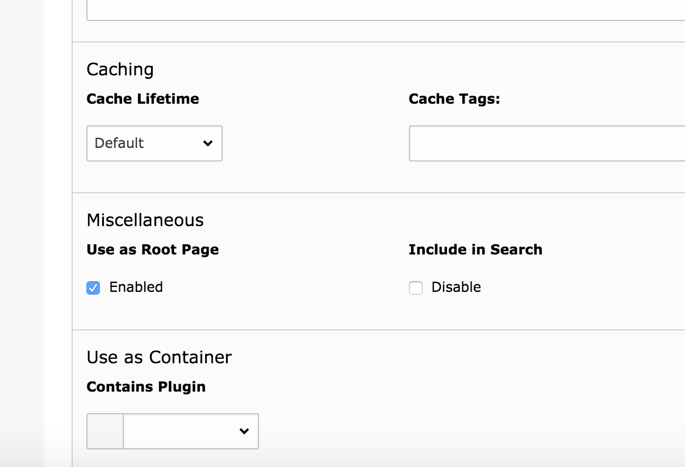

# Installation

## Composer

Wechsele in das TYPO3 Verzeichnis und installiere die Extension SOLR mit folgendem Befehl:

composer require typo3-ter/solr

## Einrichtung

* Wechsele in den Bereich "Extensions"
    * Gebe bei Suche "solr" ein
    * Aktiviere die Extension  

# Konfiguration

## Statisches Typoscript inkludieren

* Wechsele in den Bereich "Template" und wähle den obersten Knoten der Webseite aus
    * Wähle "Info/Modify" im Dropdown aus
    * Wähle "Edit the whole template record"
    * Wähle im Menü "Includes"
    * Klicke rechts auf die Option "Search - Base Configuration (solr)" und füge sie hinzu
    * Klicke auf "Save" um die Einstellungen zu speichern
    
 

## Konstanten für die SOLR Connection einrichten

Aktualisiere die Konstanten auf Deiner Root-Page mit folgendem Typoscript:

plugin {
    tx_solr {
        solr {
            host = localhost
            port = 8983
        }
    }
}

Denke daran, den Wert für host anzupassen, wenn SOLR auf einem externen Server läuft.

## Search Marker

EXR:solr indexiert alles zwischen 

<!-- TYPO3SEARCH_begin --> und <!-- TYPO3SEARCH_end -->

Sollten diese Marker nicht vorhanden sein, müssen diese hinzugefügt werden. Vor allem um die Qualität zu erhöhen und nur die relevanten Inhalte zu indexieren.
Der einfachste Weg ist, dies mit Typoscript zu tun:

page.10 {
    stdWrap.dataWrap = <!--TYPO3SEARCH_begin-->|<!--TYPO3SEARCH_end-->
}

## Indexierung aktivieren

Das Indexing wird mit folgendem Tyoscript aktiviert:

config {
    index_enable = 1
}

## Root-Page definieren

Wichtig ist auch, dass die Root-Page als solche aktiviert ist.

 

* Aktviere die Checkbox bei **Use as Root Page**

## SOLR Connections intialisieren

Als nächstes müssen die SOLR Connections aktiviert werden. Zum Initialisieren wähle aus dem Menü "Initialize Solr connections":

## Verbindungen überprüfen

* Gehe zu "Reports"
* Schaue Dir an ob bei "solr" Fehlermeldungen aufgetreten sind und ob die Verbindung geklappt hat

# Indexierung

## Inhalte für Indexierung wählen

Wenn alles eingerichtet ist, wechsele auf der linken Seite zum Menüpunkt "Search". Klicke im Modul auf "Index Queue", wähle die Inhalte aus und klicke auf "Queue selected content for indexing".

## Scheduler Tasks einrichten

Damit die Indexierung tatsächlich durchgeführt wird, muss ein Scheduler Task eingerichtet werden, der auch manuell ausgeführt werden kann.

* Wähle "Scheduler"
* Füge einen neuen Task hinzu
* Wähle aus der Oberkategorie solr den task "Index Queue Worker" aus
* Klicke auf Speichern, damit wird der Task angelegt
* Klicke in der Übersicht der Scheduler beim entsprechenden Task auf das play Symbol und "Run task"

# Anzeige der Suche und Ergebnisse

## Seite anlegen

Lege unterhalb des Page Roots eine Seite "Suche" an.

## Content Element einfügen

Füge das Plugin "Search" auf der Seite ein.

## Suchen

Öffne die Seite "Suche" auf der Webseite und gebe "*" ein. Du solltest nun die ersten Inhalte sehen.

