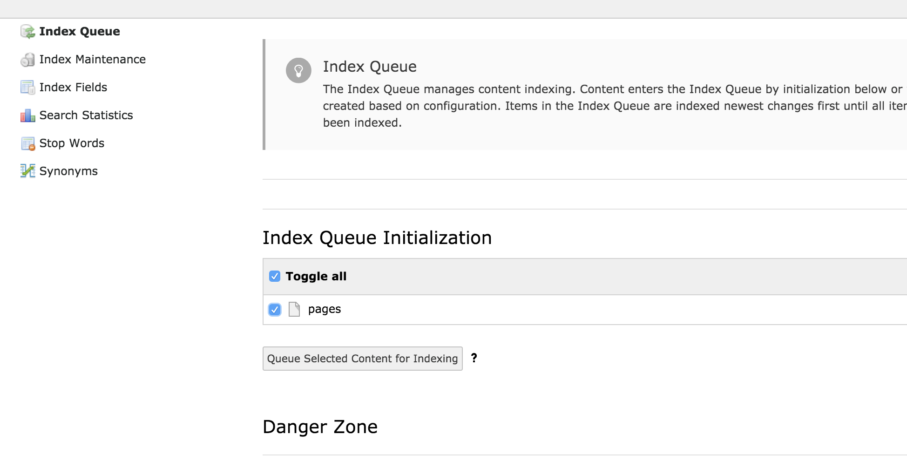
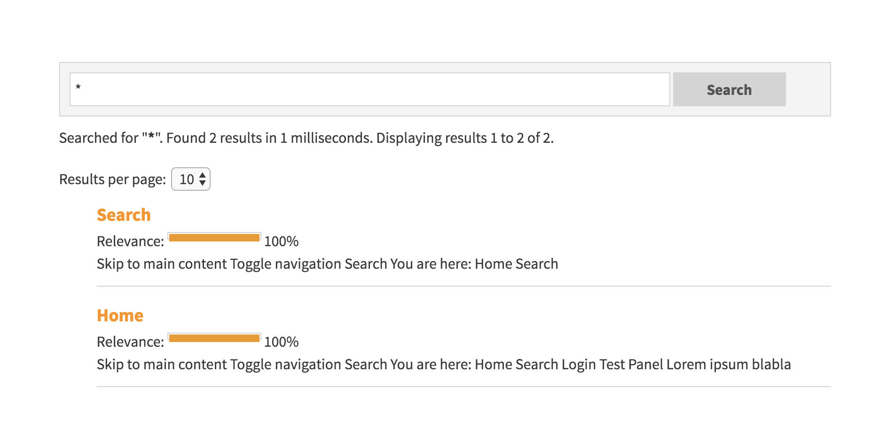

-  `Installation <#page1>`__

   -  `Composer <#part1>`__
   -  `Einrichtung <#part2>`__

-  `Konfiguration <#page2>`__

   -  `Statisches Typoscript inkludieren <#part3>`__
   -  `Konstanten für die SOLR Connection einrichten <#part4>`__
   -  `Search Marker <#part5>`__
   -  `Indexierung aktivieren <#part6>`__
   -  `Root-Page definieren <#part7>`__
   -  `SOLR Connections intialisieren <#part8>`__
   -  `Verbindungen überprüfen <#part9>`__

-  `Indexierung <#page3>`__

   -  `Inhalte für Indexierung wählen <#part10>`__
   -  `Scheduler Tasks einrichten <#part11>`__

-  `Anzeige der Suche und Ergebnisse <#page4>`__

   -  `Seite anlegen <#part12>`__
   -  `Content Element einfügen <#part13>`__
   -  `Suchen <#part14>`__

-  `Anpassung <#page5>`__

   -  `Anpassung der Templates in Version 7 <#part15>`__

      .. rubric:: Installation

Composer
========

Wechsele in das TYPO3 Verzeichnis und installiere die Extension SOLR mit
folgendem Befehl:

.. raw:: html

   <pre><code>composer require typo3-ter/solr</code></pre>

Einrichtung
===========

-  Wechsele in den Bereich "Extensions"

   -  Gebe bei Suche "solr" ein
   -  Aktiviere die Extension

Konfiguration
=============

Statisches Typoscript inkludieren
---------------------------------

-  Wechsele in den Bereich "Template" und wähle den obersten Knoten der
   Webseite aus

   -  Wähle "Info/Modify" im Dropdown aus
   -  Wähle "Edit the whole template record"
   -  Wähle im Menü "Includes"
   -  Klicke rechts auf die Option "Search - Base Configuration (solr)"
      und füge sie hinzu
   -  Klicke auf "Save" um die Einstellungen zu speichern

|Bild 1|

Konstanten für die SOLR Connection einrichten
---------------------------------------------

Aktualisiere die Konstanten auf Deiner Root-Page mit folgendem
Typoscript:

.. raw:: html

   <pre><code><a href="http://documentation.typo3.org/documentation/tsref/tlo-objects/plugin/">plugin</a> &#123;
   &nbsp; &nbsp; tx_solr &#123;
   &nbsp; &nbsp; &nbsp; &nbsp; solr &#123;
   &nbsp; &nbsp; &nbsp; &nbsp; &nbsp; &nbsp; host = localhost
   &nbsp; &nbsp; &nbsp; &nbsp; &nbsp; &nbsp; port = 8983
   &nbsp; &nbsp; &nbsp; &nbsp; &#125;
   &nbsp; &nbsp; &#125;
   &#125;</code></pre>

Denke daran, den Wert für host anzupassen, wenn SOLR auf einem externen
Server läuft.

Search Marker
-------------

EXR:solr indexiert alles zwischen

.. raw:: html

   <pre><code>&lt;!-- TYPO3SEARCH_begin --&gt; und &lt;!-- TYPO3SEARCH_end --&gt;</code></pre>

Sollten diese Marker nicht vorhanden sein, müssen diese hinzugefügt
werden. Vor allem um die Qualität zu erhöhen und nur die relevanten
Inhalte zu indexieren. Der einfachste Weg ist, dies mit Typoscript zu
tun:

.. raw:: html

   <pre><code>page.10 &#123;
   &nbsp; &nbsp; <a href="http://documentation.typo3.org/documentation/tsref/functions/stdWrap/">stdWrap</a>.dataWrap = &lt;!--TYPO3SEARCH_begin--&gt;|&lt;!--TYPO3SEARCH_end--&gt;
   &#125;</code></pre>

Indexierung aktivieren
----------------------

Das Indexing wird mit folgendem Tyoscript aktiviert:

.. raw:: html

   <pre><code>config &#123;
   &nbsp; &nbsp; index_enable = 1
   &#125;</code></pre>

Root-Page definieren
--------------------

Wichtig ist auch, dass die Root-Page als solche aktiviert ist.

|Bild 2|

-  Aktviere die Checkbox bei **Use as Root Page**

SOLR Connections intialisieren
------------------------------

Als nächstes müssen die SOLR Connections aktiviert werden. Zum
Initialisieren wähle aus dem Menü "Initialize Solr connections":

|Bild 3|

Verbindungen überprüfen
-----------------------

-  Gehe zu "Reports"
-  Schaue Dir an ob bei "solr" Fehlermeldungen aufgetreten sind und ob
   die Verbindung geklappt hat

Indexierung
===========

Inhalte für Indexierung wählen
------------------------------

Wenn alles eingerichtet ist, wechsele auf der linken Seite zum Menüpunkt
"Search". Klicke im Modul auf "Index Queue", wähle die Inhalte aus und
klicke auf "Queue selected content for indexing".

|Bild 4|

Scheduler Tasks einrichten
--------------------------

Damit die Indexierung tatsächlich durchgeführt wird, muss ein Scheduler
Task eingerichtet werden, der auch manuell ausgeführt werden kann.

-  Wähle "Scheduler"
-  Füge einen neuen Task hinzu
-  Wähle aus der Oberkategorie solr den task "Index Queue Worker" aus
-  Klicke auf Speichern, damit wird der Task angelegt
-  Klicke in der Übersicht der Scheduler beim entsprechenden Task auf
   das play Symbol und "Run task"

|Bild 5|

Anzeige der Suche und Ergebnisse
================================

Seite anlegen
-------------

Lege unterhalb des Page Roots eine Seite "Suche" an.

|Bild 6|

Content Element einfügen
------------------------

Füge das Plugin "Search" auf der Seite ein.

|Bild 7|

Suchen
------

Öffne die Seite "Suche" auf der Webseite und gebe "\*" ein. Du solltest
nun die ersten Inhalte sehen.

|Bild 8|

Anpassung
=========

Anpassung der Templates in Version 7
------------------------------------

Der Pfad zu den Templates kann über folgendes Typoscript angepasst
werden. Der entsprechende Vermerk dazu findet sich auch in
**Configuration/TypoScript/Solr/setup.txt**

.. raw:: html

   <pre><code><a href="http://documentation.typo3.org/documentation/tsref/tlo-objects/plugin/">plugin</a>.tx_solr &#123;
   &nbsp; &nbsp; &nbsp; &nbsp; // By convention the templates get loaded from EXT:solr/Resources/Private/Templates/Frontend/Search/(ActionName).html
   &nbsp; &nbsp; &nbsp; &nbsp; // If you want to define a different entry template, you can do this here to overwrite the convensional default template
   &nbsp; &nbsp; &nbsp; &nbsp; templateFiles &#123;
   &nbsp; &nbsp; &nbsp; &nbsp; &nbsp; &nbsp; &nbsp; &nbsp; frequentSearched = EXT:solr/Resources/Private/Templates/Search/FrequentlySearched.html
   &nbsp; &nbsp; &nbsp; &nbsp; &nbsp; &nbsp; &nbsp; &nbsp; results = EXT:solr/Resources/Private/Templates/Search/Results.html
   &nbsp; &nbsp; &nbsp; &nbsp; &nbsp; &nbsp; &nbsp; &nbsp; form = EXT:solr/Resources/Private/Templates/Search/Form.html
   &nbsp; &nbsp; &nbsp; &nbsp; &#125;
   &#125;</code></pre>

.. |Bild 1| image:: images/static_typoscript.png
.. |Bild 2| image:: images/root_page.png
.. |Bild 3| image:: images/solr_connection.png

.. |Bild 5| image:: images/scheduler.png

.. |Bild 7| image:: images/add_plugin.png

